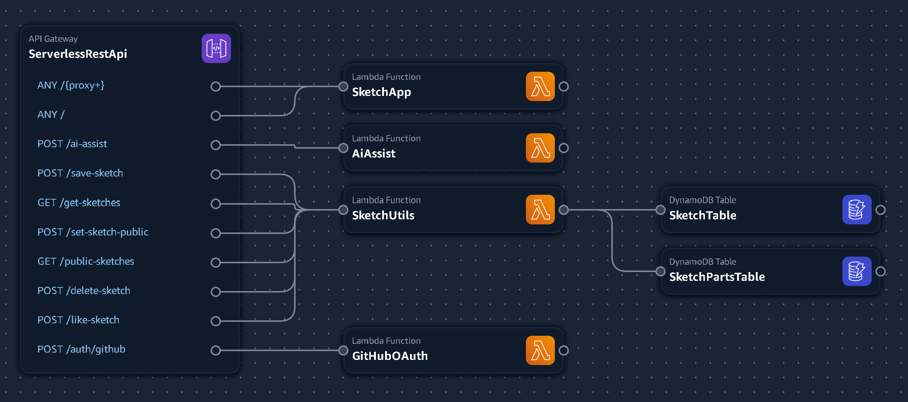

#  AI-Powered Sketch App - AWS Lambda Hackathon 2025

<!-- these may not working of API of huyhieu changed -->

A fully serverless sketch application with AI-powered style transformation, built for the [**AWS Lambda Hackathon 2025**](https://awslambdahackathon.devpost.com). Draw, create, and transform your sketches using Amazon Bedrock's Titan Image Generator, all powered by AWS Lambda functions.

## 🚀 Demo
- ~~https://8b8qylx3db.execute-api.us-west-2.amazonaws.com/Prod~~
- 

## ✨ Features
- **Snapshot Timeline**: Visual timeline of your drawing iterations
- **Sketch Download**: Save your creations
- **UI Responsive**: Works seamlessly on desktop and mobile devices
- **Amazon Bedrock Integration**: Titan Image Generator v2
- **100% Serverless**: No servers to manage
- **Sharing is caring**: fun to browse others' creative sketch

## 🏛️ Architecture

- See more [DEV_NOTE](./DEV_NOTE.md)

## 🔨 Built With
- AWS Lambda, API Gateway, DynamoDB, Bedrock
- AWS Lambda powers the entire app, handling both the frontend and backend, and acting as middleware to connect the frontend with DynamoDB and Bedrock. API Gateway routes requests to Lambda endpoints, exposing the app to users.

### Quick Links
- [AWS Lambda Hackathon](https://awslambdahackathon.devpost.com/)
